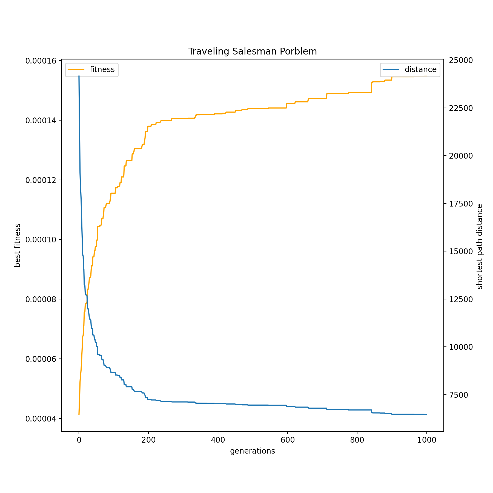
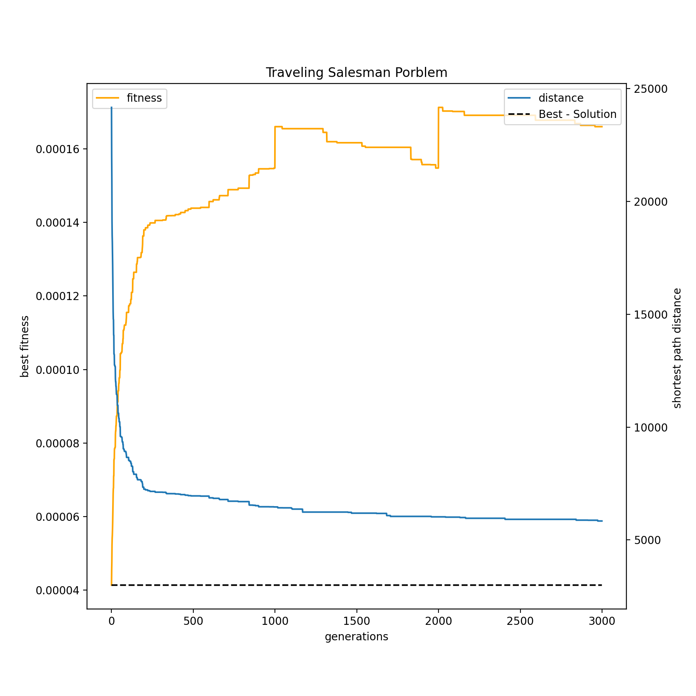
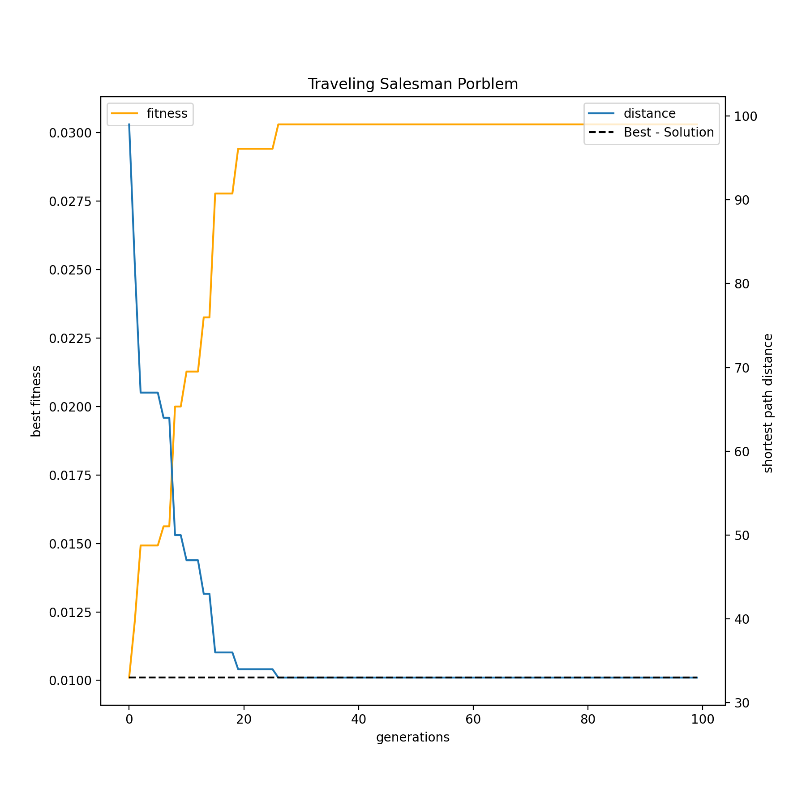

# Algoritmos Genéticos Aplicados ao Problema do Caixeiro Viajante
 
 ## O Problema do Caixeiro Viajante 

 O problema do caixeiro viajante, ou traveling salesman problem(TSP), consiste  em determinar o caminho mais eficiente entre dois pontos passando em todas N cidades no meio do caminho sem repetir. Se trata de um problema de análise combinatória, uma vez que o caixeiro pode realizar N! caminhos. Computacionalmente seria muito custoso realizar o cálculo de todos caminhos possíveis, por exemplos, se ele tivesse que passar por 10 cidades haveriam 10!=3628800 caminhos.

<br/><br/>
 <br/><br/>

 <br/><br/>

 


## Algoritmos Genéticos
 Os algoritmos genéticos foram inicialmente desenvolvidos na década de 60 [2] para tentar imitar a evolução, especeficamente o processo de seleção natural. O algoritmo é projetado de tal forma que faz uma pressão evolutiva para selecionar as melhores soluções a cada geração. A fim de representar esse processo da seleção natural o algoritmo é iniciado com uma população aleatória, onde os melhores indivídos (com os melhores fitness) são selecionados para reprodução que pode se dar de inúmeras formas, por último após os genes dos novos indivíduos serem selecionados um fator probabilistico pode gerar uma mutação nos genes incluindo variabilidade na população. 


### Fitness da População

Para determinar o quão bom os genes de um indivíduo são utiliza-se uma função f(x) para determinar o fitness. Os algoritmos genéticos foram idealizados para resolver problemas de maximização, no caso do problema do caixeiro viajante e de problemas de minimização definimos uma função F(x)= 1/f(x) por exemplo.

No nosso problema o fitness do indivíduo é inversamente proporcioanl a  distância total percorrida ao longo do caminho passando por todas as cidades. 

### A Roleta da Escolha dos pais

Para escolher os indivíduos que farão a reprodução é utilizado o método da roleta. Ele consiste em somar todos os fitness, gerar um número aleatoriamente dentro do intervalo [0,soma dos fitness) e escolher o indivíduo que estiver contiver o número sorteado.

Por exemplo, sejam os fitness 100,200,400. A soma dos fitness é de 700.

[0,100) -> indivíduo A é escolhido
[100,300) -> indivíduo B é escolhido
[300,700) -> indivíduo C é escolhido

Se o número sorteado for 359, o indivíduo C será escolhido para a reprodução e passará seus genes a diante

Utilizando esse método damos prioridade aos indivíduos com maior fitness, pois ele é chamado de um método de seleção proporcional. Um problema que pode surgir na utilização deste método é um indivíduo com alto fitness tomar conta da população de forma a inibir a variabilidade.


### Operadores de Crossover

Há diversos tipos de algoritmos de crossover cujo objetivo é fazer a mistura dos genes dos pais de forma aleatória preservando o conceito do problema do caixeiro viajante. Conforme demostrado no artigo referenciado abaixo [1], o operador de construção sequencial (Sequential constructive crossover operator) apresenta melhores resultados que outros dois operadores que serão implementados futuramente na classe Crossover.

#### SCRX

O Operador SCRX consiste em pegar olhar o caminhos que os dois pais fazer e ir construindo o gene dos filhos a partir das melhores carcterísticas nos dois. Por exemplo, sejam os pais [1,2,3,5,4,6,7] e [1,2,5,4,3,6,7], isto significa que o caminhos que o primeiro pai começa na cidade numero 1, depois vai para a cidade numero 2 e  assim sucessivamente. Conforme exemplificado inicia-se no primeiro nodo, em seguindo verifica-se em cada pai o primeiro nodo legítimo, isto é, aquele que ainda não foi inserido no filho. Após termos dois nodos válidos, observamos o custo, ou o fit de cada opção, aquela que tiver o melhor fit permanecerá enquanto gene do filho. Isto é feito sucessivamente até que os genes do filho estejam definidos.

Se nenhum dos pais tiver um gene válido, procuramos o primeiro gene válido na lista de todos os genes possíveis. Ou seja, vemos de forma ordenada qual a primeira cidade que não faz parte do caminho do filho.

[1,2,3,5,4,6,7] e [1,2,5,4,3,6,7] ---- filho [None,None,None,None,None,None,None]

Pai 1, Mae 1 - filho [1,None,None,None,None,None,None]

Pai 2, Mae 2 - filho [1,2,None,None,None,None,None]

Pai 3(fit=50), Mae 5(fit=70) - filho [1,2,5,None,None,None,None]

Pai 4, Mae 4 - filho [1,2,5,4,None,None,None]

Pai 6(fit=40), Mae 3(fit=70) - filho [1,2,5,4,3,None,None]

Pai 6, Mae 6 - filho [1,2,5,4,3,6,None]

Pai 7, Mae 7 - filho [1,2,5,4,3,6,7]

filho [1,2,5,4,3,6,7]

#### OX 

O operador ordenado (order crossover)  consiste em gerar dois números aleatórios que representem dois pontos dos genes dos indivíduos. Os genes no meio do intervalo sorteado são pegos pai e passados para o filho. Em seguida, retira-se os genes que já pertencem  ao filho que estão nos genes da mãe, então de forma ordenado os genes da mãe assumem as posições fora da invervalo sorteado, preenchendo primeiramente o espaço após o intervalo. A figura abaixo exemplifica este processo.


### Mutação

O mecanismo de mutação implementado consiste na troca da posição de genes. Há uma probabilidade de que cada indivíduo da população sofra mutação. Caso o indíduo seja selecionado para receber a mutação são sorteados dois número inteiros que correspondem a posição dos genes que trocarçao de posição.

## Guia Rápido do Código 

 Importando a classe e inicializando 1000 gerações, uma população com 300 indivíduos e um caminho que passa por 300 cidades

```
from ga import Genetic_algorithm, Crossover
tsp=Crossover(number_of_cities=171, generations=1000, population_size=300)
```

Utilizando a matriz de distâncias do problema assimétrico do caixeiro viajante para 171 cidades e fazendo rodar para  1000 gerações usando o método de crossover SCRX
```
teste.TSPLIB('http://elib.zib.de/pub/mp-testdata/tsp/tsplib/atsp/ftv170.atsp')
tsp.run(crossover_function=tsp.SCRX)
```
Printando o fitness das populações através as gerações bem como os genes da população. E estamos gerando um gráfico do mínimo da mínima distância através das gerações.

```
teste.graph(best_known_solution=2755,save=True,name_img='tsp_fftv170_1000_generations_300_pop.png')
```

## Alguns resultados obtidos com o Algoritmo


### [FTV170](http://elib.zib.de/pub/mp-testdata/tsp/tsplib/atsp/ftv170.atsp) - 171 Cidades







### [BR17](http://elib.zib.de/pub/mp-testdata/tsp/tsplib/atsp/br17.atsp)




### Genetic algorithm
Há duas classes no programa a primeira detem a estrutura fundamental para um tipo de tratamento dos algoritmos genéticos, a segunda contém os operadores que realizam o crossovers nos arrays fazendo o cruzamento entre os pais.
#### Atributos

number_of_cities - Número de cidades no problema
population_size - Número de individos na população 
mutation_prob - Probabilidade de mutação
generations - Número de gerações
seed - Número da SEED dos números aleatórios
population - População da geração atual
fitness_pop - fitness da população na geração atual
fitness_history - histórico do fitness das populações 
population_hystory - histórico das populações em cada geração


#### Métodos 

fitness(cost_matrix,maxmization) - função que calcula o fitness de cada população

Mutation()- função para gerar a mutação nos indivídos

roullete_wheel_selection() - função para escolher os pais da próxima geração

crossover_selection() - seleciona os indivíduos que sofreram crossover, dependendo da probabiliade de crossover que é passada no construtor.

elitism() - Caso o parâmetro elite seja diferente de 0, uma fração dos melhores indivíduos da generação atual será passada para a próxima sem qualquer modificação.

run(crossover_function,mutation,first_round) - função que itera e roda o código pelo número de gerações incializado. Caso não seja a primeira rodada de dados será necessário passar o argumento first_round=False. Se não deseja que haja mutação no algoritmo é necessário passar o argumento mutation=False, o padrão é mutation=True.

dataframe() - gera um dataframe dos dados dos genes das populações de cada geração

graph(best_known_solution=False,save=False,name_img=None) - Gera um gráfico da distância mínima e do fitness máximo a cada geraação. Se save=True, a imagem será salva e será necessário passar um nome pela variável name_img. Além disso, é possível passar uma reta contento o valor da melhor solução conhecida por meio do argumento best_known_solutions, é esperado um float. 

TSPLIB(url) - utiliza a biblioteca TSPLIB que contém dados e soluções de diversos problemas do caixeiro viajante. É necessário passar a url da matriz com os dados do problema que almeja-se que seja solucionado. Após isso a matriz que define as distâncias será a que é apresentada no site.


### Crossover

A classe Genetic algorithm é a superclasse da classe Crossover

#### Métodos 

SCRX(parents_number)

OX(parents_number)


## Referências

[1] [Ahmed, Zakir. (2010). Genetic Algorithm for the Traveling Salesman Problem using Sequential Constructive Crossover Operator. International Journal of Biometric and Bioinformatics. 3. 10.14569/IJACSA.2020.0110275.](https://www.researchgate.net/publication/41847011_Genetic_Algorithm_for_the_Traveling_Salesman_Problem_using_Sequential_Constructive_Crossover_Operator) 

[2][Potvin, Jean-Yves. "Genetic algorithms for the traveling salesman problem." Annals of Operations Research 63.3 (1996): 337-370.
](https://link.springer.com/article/10.1007%252FBF02125403)
## Comentários

O presente código foi inicialmente desenvolvido para ser o trabalho final da matéria [Métodos Computacionais em Física II](). Além do código um [relatório](/pdf/relatorio.pdf) foi produzido, e pode ser encontrado na pasta pdf.
